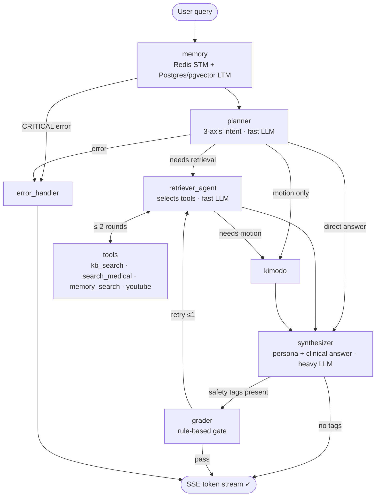
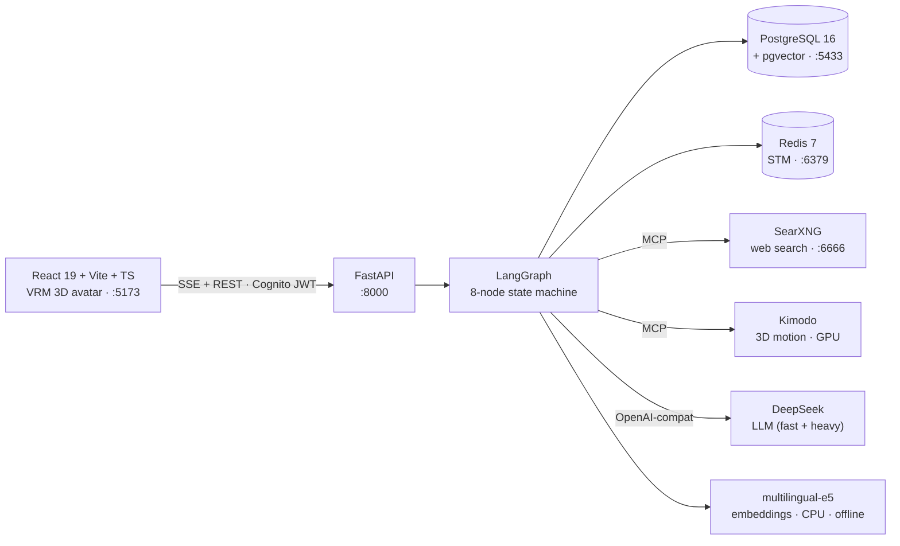

<p align="center">
  <h1 align="center">🧠 Virtual Verbal Assistant (VVA)</h1>
  <p align="center">
    <strong>A multimodal, bilingual (Vietnamese / English) healthcare assistant for physical-therapy exercise guidance — built on a LangGraph multi-agent supervisor with clinical-safety grading, long-term memory, retrieval-augmented generation, token streaming, and an optional 3D avatar.</strong>
  </p>
</p>

<p align="center">
  
  
  
  
  
</p>

---

## ✨ What it does

A user asks *"Tôi bị đau lưng dưới khi ngồi lâu, có bài tập nào không?"* ("I get lower-back pain from sitting too long — any exercises?") and VVA:

1. **Classifies intent** and plans which knowledge sources are needed.
2. **Retrieves** from an internal PT knowledge base (vector search) and, when the user opts in, the live web.
3. **Synthesizes** a clinically-framed answer — exercises with sets/reps and **safety warnings** — styled in the chosen persona (warm / clinical / friendly).
4. **Streams** the answer token-by-token to the browser over SSE.
5. Optionally renders a **3D motion** demonstration and drives an expressive **VRM avatar** — facial expressions, blinking, eye gaze and amplitude lip-sync — plus **Vietnamese speech**.

Every answer that carries a safety-relevant tag passes a **rule-based quality gate** before it reaches the user.

---

## 🗺️ How it works — request flow



**8 nodes, two independent routing gates** (retrieval gate + grader gate), a bounded retriever⇄tools loop, and a graceful error path on every edge.

| Node | Role | LLM calls |
|------|------|-----------|
| `memory` | Redis short-term memory (FIFO) + conditional Postgres/pgvector long-term recall | 0 |
| `planner` | 3-axis intent (required outputs · resolved query · needs-retrieval/motion) | 1 (fast) |
| `retriever_agent` | Chooses & calls tools per plan; loops with `tools` (hard cap 2 rounds) | 1+ (fast) |
| `tools` | ToolNode: `kb_search`, `search_medical`, `memory_search`, `resume_last_session`, `youtube_transcript` | 0 |
| `kimodo` | Fires 3D motion synthesis (MCP, GPU) | 0 |
| `synthesizer` | Persona-styled clinical answer from evidence | 1 (heavy) |
| `grader` | Rule-based quality/safety check, ≤1 retry | 0 |
| `error_handler` | Graceful Vietnamese fallback on CRITICAL errors | 0 |

---

## 🧱 System & stack



| Layer | Technology |
|---|---|
| **Orchestration** | LangGraph state machine (pure-async nodes), MCP tool servers, per-role circuit breakers |
| **LLM** | DeepSeek (OpenAI-compatible) — fast model for planner/retriever, heavy model for synthesizer |
| **Retrieval** | PostgreSQL 16 + **pgvector** (HNSW, 384-dim), `intfloat/multilingual-e5-small` (query:/passage: prefixes), SearXNG metasearch |
| **Memory** | Redis STM + Postgres/pgvector LTM, background summarizer, GDPR delete + re-summarize |
| **API** | FastAPI, Server-Sent Events (token streaming), Pydantic schemas |
| **Auth** | AWS Cognito ID-token verification (JWKS · RS256 · audience · issuer). Mandatory in every environment — no flag relaxes it; dev and production differ only in which pool they trust |
| **Frontend** | React 19, Vite, TypeScript, Tailwind/shadcn, three.js + `@pixiv/three-vrm` avatar with a channel-based **facial-animation** system (R3F-native), axios (REST) + fetch (SSE stream) |
| **Infra** | Docker Compose (Postgres · Redis · SearXNG), Alembic migrations |

---

## 📊 By the numbers

| | |
|---|---|
| **LangGraph nodes** | 8 (memory → planner → retriever⇄tools → kimodo → synthesizer → grader → error_handler) |
| **Test cases** | 312 (275 unit + 37 integration; circuit-breaker, routing, memory-regression, GDPR, auth) |
| **Backend** | ~7,800 LOC Python |
| **Frontend** | ~4,200 LOC TypeScript/React |
| **Data model** | 7 Postgres tables (`users`, `conversations`, `messages`, `summaries`, `user_memory`, `documents`, `kb_embeddings`) |
| **Architecture decisions** | 33 recorded (D1–D33) in [docs/plans/reupdate-plan.md](docs/plans/reupdate-plan.md) |
| **Languages** | Vietnamese + English (multilingual embeddings & prompts) |
| **Personas** | 3 (default / friendly / clinical) as editable Markdown |

---

## 🔬 Engineering highlights

- **Multi-agent supervisor, not a single prompt** — intent, retrieval, reasoning and grading are separate nodes with independent routing; the retriever⇄tools loop is **hard-capped** in the graph (not left to the model).
- **Clinical safety gate** — answers tagged with safety-relevant contracts must pass a deterministic grader (with a bounded retry) before streaming.
- **Real memory** — short-term (Redis FIFO) + long-term vector recall, a background summarizer, and **GDPR** message/user deletion that re-summarizes affected chunks.
- **Security-aware** — Cognito JWT verification (JWKS/RS256/audience/issuer); when enabled it ignores client-supplied IDs and derives the user from the token, closing an IDOR class.
- **User-controlled web search (enforced at every layer)** — turning it off removes the tool from the model's bind list, omits it from the prompt, **and** blocks it at execution — mirroring how mature assistants gate "search off".
- **Resilience** — per-role circuit breakers on DeepSeek + MCP, three-tier error severity (CRITICAL / RECOVERABLE / IGNORABLE), parallel dependency health checks, socket-timeout-bounded Redis ops.
- **Offline, CPU-only embeddings** — the e5 model loads fully from local cache (zero HuggingFace-Hub calls at startup), freeing the GPU for 3D motion.
- **Expressive avatar, framework-agnostic** — a channel-based facial-expression **mixer** (delta-time cross-fade, physiological blink, autonomous idle wander, mouse-tracked eye gaze, amplitude lip-sync) composed on one `useFrame` tick, with capability detection that degrades safely on models missing blendshapes — decoupled from body motion so it rides on top of whatever drives the body (Kimodo).
- **True token streaming** — SSE tokens reach the browser progressively during generation; getting there meant fixing a LangGraph custom-stream drain-starvation on the server and a CRLF SSE-boundary bug on the client.
- **Observability** — structured JSON logs correlated by `request_id`, SSE `stage` events for live pipeline tracing (a "🔍 searching…" indicator while tools run).

---

## 🚀 Quick start

> Full setup, troubleshooting and log-analysis: **[docs/ops/runbook.md](docs/ops/runbook.md)** · **[docs/ops/setup-guide.md](docs/ops/setup-guide.md)**

```bash
# 1. Infra
docker compose -f docker-compose.langgraph.yml up -d      # Postgres :5433 · Redis · SearXNG :6666

# 2. Backend (Python) — conda env, port 8000
conda activate firstconda
pip install -r requirements-langgraph.txt                 # first time
cd agenticRAG/langgraph_agents && alembic upgrade head    # must run FROM this dir
cd ..
python -m uvicorn langgraph_agents.api.main:create_app --factory --port 8000 --host 0.0.0.0

# 3. Knowledge base — REQUIRED on a fresh install, else every clinical
#    question is refused because kb_embeddings is empty
python scripts/ingest_kb_pgvector.py --reset              # ~2918 exercises

# 4. Frontend (React) — port 5173
cd ECA_UI/frontend && npm install && npm run dev
```

Open **http://localhost:5173** (demo mode: no login required). Backend URL is read from `ECA_UI/frontend/.env.local` (`VITE_API_BASE_URL`, default `http://localhost:8000`).

**Verify:**

```bash
curl http://localhost:8000/health            # {"status":"ok"}
curl http://localhost:8000/health/detailed   # parallel PG/Redis/MCP/LLM/SearXNG checks
                                             # "degraded" with speechllm down is expected — TTS is optional
python -m pytest tests/langgraph_agents/ -m unit -q   # unit suite (no live services)
```

---

## 🔌 API

| Endpoint | Method | Purpose |
|---|---|---|
| `/chat` | POST | Submit a query, stream SSE (`stage` → `token` → `done`) |
| `/sessions?user_id=` | GET | List a user's sessions (with first-message preview) |
| `/sessions/{id}` | GET | Load a session's messages (resume) |
| `/users/{id}/memory` | GET · POST · DELETE | User long-term facts (GDPR-aware) |
| `/health` · `/health/detailed` | GET | Liveness · readiness (dependency + breaker states) |

<details>
<summary><code>POST /chat</code> body & SSE events</summary>

```jsonc
// request
{ "query": "Bài tập cho đau lưng", "user_id": "…", "session_id": "…",
  "persona_id": "eca_default", "output_mode": "text", "web_search": false }
```
```
event: stage   data: {"node":"planner","status":"complete"}
event: token   data: {"content":"Bài "}
event: done    data: {"request_id":"…","total_tokens":423,"required_outputs":["exercise_protocol"]}
```
</details>

---

## 📁 Layout

```
agenticRAG/langgraph_agents/
├── api/           # FastAPI app · SSE · auth (Cognito) · health
├── nodes/         # memory · planner · retriever_agent · synthesizer · grader · kimodo · error_handler
├── tools/         # in-process @tool wrappers (kb_search, …)
├── mcp/           # MCP servers (web search, kimodo) + client w/ circuit breaker
├── shared/        # embeddings (offline e5) · structured logging
├── db/ · alembic/ # asyncpg client · session store · migrations (7 tables)
├── personas/      # eca_default / eca_friendly / eca_clinical (Markdown)
├── graph.py · routing.py · state.py · llm.py
ECA_UI/frontend/   # React 19 + Vite + TS + Tailwind · lib/api.ts (axios + SSE)
├── src/avatar/    # facial-animation system: mixer · expression/blink/eye/idle/lipsync controllers · VRM adapter
docs/              # architecture/ · ops/ · plans/ · phases/ · fixes/
tests/langgraph_agents/   # 312 tests (275 unit + 37 integration)
```

---

## 📚 Documentation

| Doc | What |
|---|---|
| [docs/architecture/system-overview.md](docs/architecture/system-overview.md) | High-level architecture |
| [docs/architecture/full-flow-predeploy.md](docs/architecture/full-flow-predeploy.md) | End-to-end request flow |
| [docs/plans/reupdate-plan.md](docs/plans/reupdate-plan.md) | Design decisions D1–D33 (source of truth) |
| [docs/plans/facial-animation-plan.md](docs/plans/facial-animation-plan.md) | Avatar facial-animation system (Phase A–D) |
| [docs/architecture/api-contract.md](docs/architecture/api-contract.md) | API + SSE event contract (incl. avatar events) |
| [scripts/QUICKSTART.md](scripts/QUICKSTART.md) | Local run: ports, env vars, common errors |
| [docs/ops/runbook.md](docs/ops/runbook.md) · [docs/ops/troubleshooting.md](docs/ops/troubleshooting.md) | Run · debug · common errors |
| [.claude/CLAUDE.md](.claude/CLAUDE.md) | Conventions & roles |

---

## 🧭 Status & roadmap

- ✅ Core pipeline (8-node graph), memory, RAG, personas, live SSE token streaming, session resume
- ✅ Auth mechanism (Cognito JWT), GDPR memory ops, circuit breakers, health checks
- ✅ Web-search user-toggle enforcement · offline embeddings · retriever loop cap
- ✅ Avatar facial-animation system (expressions · blink · gaze · lip-sync), decoupled from body motion
- 🔜 **Knowledge-base ingest** into pgvector (populate `documents`/`kb_embeddings`)
- 🔜 **Backend emotion events** to drive avatar expressions (Conversation node → `avatar.emotion` SSE)
- 🔜 **Pre-cloud hardening** — enable auth, rate limiting, secret management
- 🔜 **Phase 7** — hybrid edge-cloud (cloud API + edge GPU worker for 3D motion / Kimodo)

<p align="center"><sub>LangGraph · FastAPI · DeepSeek · PostgreSQL/pgvector · Redis · MCP · React · three.js/VRM · SSE</sub></p>
